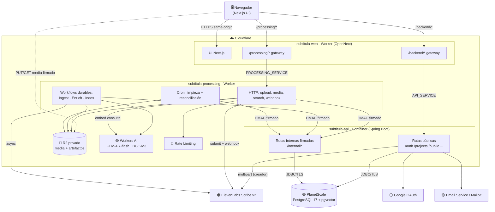
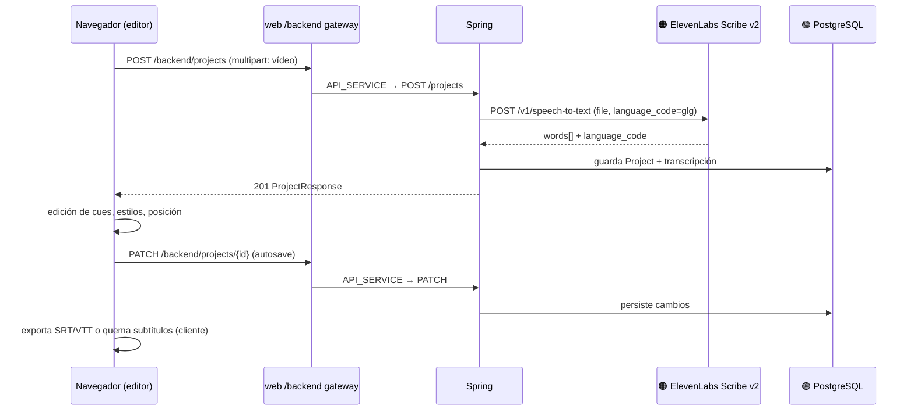
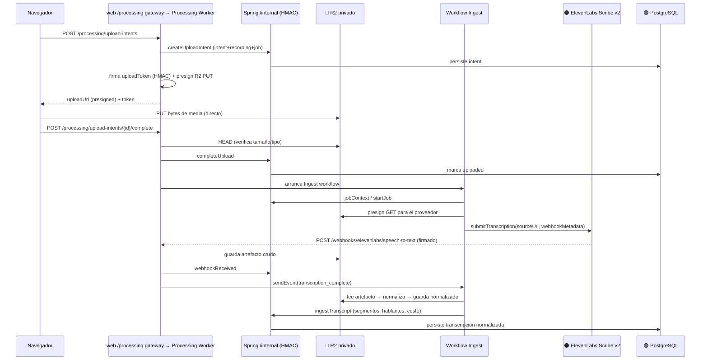
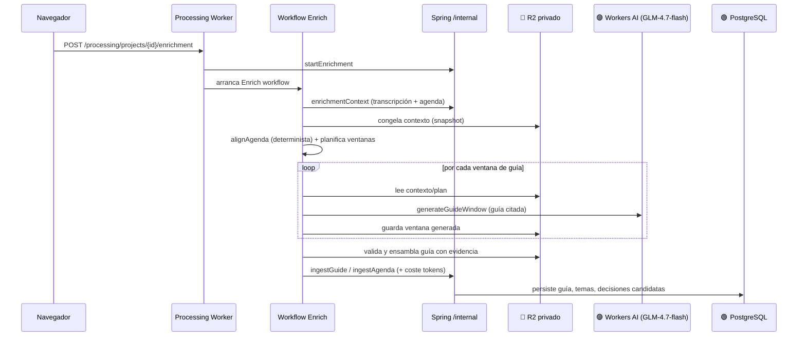
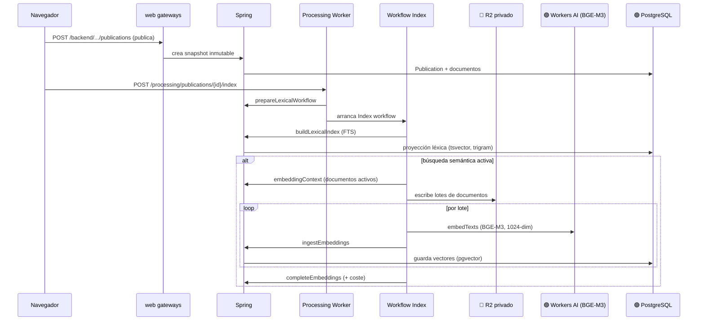
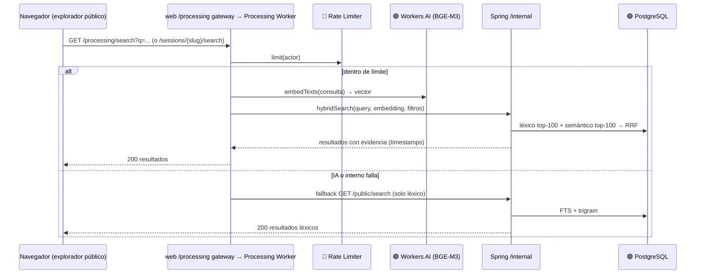
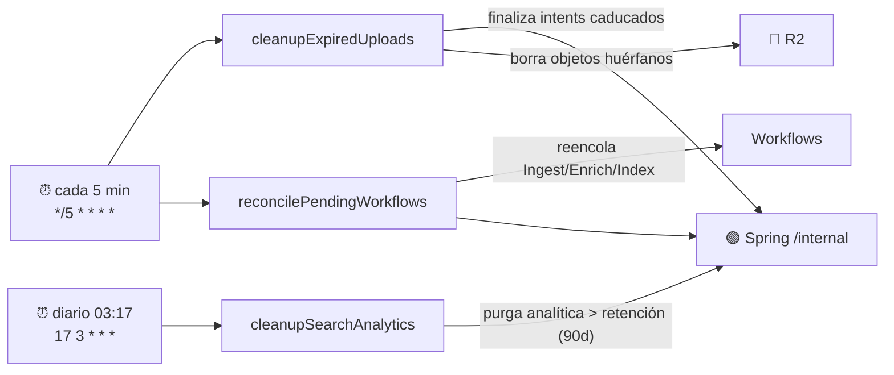

# subtitula.gal — Arquitectura y flujos

Diagramas de alto nivel de los dos repos (`subtitula-gal` = frontal, `subtitula-gal-api` = back)
y de los servicios externos que ataca cada paso. Los diagramas están en **Mermaid**: un mapa de
contenedores para el funcionamiento general y diagramas de secuencia por flujo, que es donde se ve
qué servicio externo interviene en cada función.

> Estado (a 30-jul-2026): base *hosted dev* desplegada; la vertical institucional/transparencia
> está implementada en local detrás de *capabilities* apagadas. Los diagramas describen el sistema
> completo tal como está en el código, marcando lo que hoy está *dark*.

---

## Piezas del sistema

| Componente | Repo | Runtime | Rol |
|---|---|---|---|
| **subtitula-web** | `subtitula-gal` | Next.js + OpenNext sobre **Cloudflare Worker** | UI + dos *gateways* same-origin: `/backend/*` y `/processing/*` |
| **subtitula-api** | `subtitula-gal-api` | **Spring Boot** en **Cloudflare Container** (expuesto por un Worker + Durable Object) | Autoridad de dominio: auth, proyectos, evidencia, publicación, búsqueda |
| **subtitula-processing** | `subtitula-gal-api/processing-worker` | **Cloudflare Worker** + 3 Workflows | Firma R2, orquesta ElevenLabs, Workers AI y los Workflows; crons |

### Servicios externos (leyenda)

| Servicio | Para qué | Quién lo llama |
|---|---|---|
| 🟠 **ElevenLabs Scribe v2** | Transcripción voz→texto | Spring (creador, síncrono) · Processing Worker (institucional, asíncrono con webhook) |
| 🟣 **Cloudflare Workers AI** | `@cf/zai-org/glm-4.7-flash` (guía) · `@cf/baai/bge-m3` (embeddings 1024-dim) | Processing Worker (enriquecimiento, indexación, consulta de búsqueda) |
| 🔵 **Cloudflare R2** (bucket privado) | Media durable, artefactos de proveedor, transcripciones normalizadas, lotes de embeddings | Processing Worker (PUT/GET firmados); navegador (PUT/GET directo firmado) |
| 🟢 **PlanetScale PostgreSQL 17 + pgvector** | Estado de dominio, FTS léxico y vectores semánticos | Spring (JDBC/TLS directo) |
| 🟡 **Cloudflare Email Service** (prod) / **Mailpit** (local) | Verificación y reset de contraseña | Spring (`EmailSender`). En *dev* está `disabled` |
| ⚪ **Google OAuth** | Inicio de sesión federado | Spring (Spring Security OAuth2) |
| 🔴 **Cloudflare Rate Limiting / Workflows / Cron** | Límite de peticiones, ejecución durable, tareas programadas | Processing Worker |

**Autenticación entre piezas:**
- Navegador → Workers: cookie de sesión + comprobación de `Origin` y *echo* CSRF (`x-xsrf-token`).
- Processing Worker → Spring (rutas `/internal/*`): peticiones **firmadas con HMAC** (`INTERNAL_API_HMAC_SECRET`) + *nonce*.
- Web Worker → API/Processing Worker: **service bindings** (`API_SERVICE`, `PROCESSING_SERVICE`);
  un `fetch()` público entre Workers de la misma zona `workers.dev` daría el error 1042.

---

## 1. Mapa de contenedores y servicios externos



---

## 2. Autenticación (contraseña y Google)

El registro/verificación es **no bloqueante**: la sesión se crea aunque el email falle.

```mermaid
sequenceDiagram
    participant B as Navegador
    participant W as web /backend gateway
    participant S as Spring (Container)
    participant PG as 🟢 PostgreSQL
    participant M as 🟡 Email Service/Mailpit
    participant G as ⚪ Google

    rect rgb(245,245,255)
    note over B,M: Registro / login por contraseña
    B->>W: POST /backend/register (email, pass)
    W->>S: API_SERVICE → POST /register
    S->>PG: crea User + sesión (Spring Session JDBC)
    S-->>M: envía verificación (best-effort; disabled en dev)
    S-->>B: 201 + cookie de sesión
    end

    rect rgb(245,255,245)
    note over B,G: Google Sign-In
    B->>W: GET /backend/oauth2/authorization/google
    W->>S: API_SERVICE
    S-->>B: 302 a Google (pasa a través del gateway)
    B->>G: consentimiento OAuth
    G-->>B: 302 a /backend/login/oauth2/code/google
    B->>W: callback con code
    W->>S: API_SERVICE
    S->>G: intercambia code por perfil
    S->>PG: liga OAuthAccount + crea sesión
    S-->>B: 302 a la app + cookie
    end
```

---

## 3. Flujo creador (legacy, síncrono)

Camino del PoC de subtitulado individual. Spring transcribe **en línea** contra ElevenLabs; el
editor y la exportación (SRT/VTT/burn-in) son del lado del navegador. La media del creador se
conserva de momento en el navegador (IndexedDB).



---

## 4. Ingesta institucional (subida + transcripción asíncrona)

Camino de transparencia. La media va **directa del navegador a R2** (URL firmada); la transcripción
la orquesta un Workflow durable y ElevenLabs responde por **webhook**.



---

## 5. Enriquecimiento (agenda + guía estructurada)

Alinea la agenda de forma **determinista** (sin IA) y genera la guía con **Workers AI** por ventanas
acotadas y citadas. Todos los artefactos intermedios viven en R2. La revisión humana por excepción
es un paso aparte (cola corta), no un aprobado línea a línea.



---

## 6. Publicación + indexación de búsqueda

La publicación crea un **snapshot inmutable** en Spring. La indexación construye la proyección
**léxica** (FTS de Postgres) y, si procede, la **semántica** (embeddings BGE-M3 en pgvector).



---

## 7. Búsqueda híbrida pública

Fusiona candidatos léxicos y semánticos con **RRF (k=60)**. Cualquier fallo de IA o interno degrada
con gracia a **búsqueda léxica** pura. Analítica sin texto de consulta (solo HMAC + metadatos).



---

## 8. Tareas programadas (cron del Processing Worker)



---

## Notas transversales

- **Un solo código, un solo artefacto:** *local*, *dev* y *prod* ejecutan el mismo binario; solo
  cambian variables/secretos y *capabilities*. Prod promociona el mismo *digest* probado en dev.
- **Email por entorno:** local usa Mailpit (no sale correo real), dev tiene `EMAIL_PROVIDER=disabled`
  (falla visible en logs), prod usará Cloudflare Email Service (requiere dominio propio, aún diferido).
- **Reproducción privada de media:** el navegador reutiliza primero su copia en IndexedDB; si no,
  el Processing Worker autoriza contra Spring y entrega un GET R2 firmado de corta duración (en local
  hay un proxy Range porque no hay credenciales S3).
- **Sin servicios de más:** el híbrido vive en PostgreSQL/pgvector; no se usan Vectorize, AI Search,
  D1, Kafka ni Hyperdrive (Spring conecta a Postgres por JDBC directo).
</content>
</invoke>
