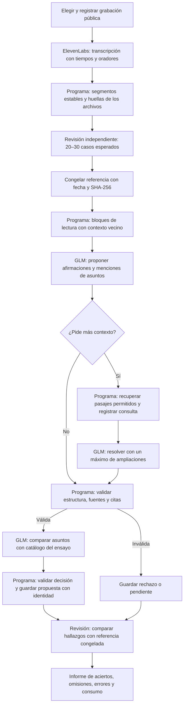

# De una conversación a un programa que usa un LLM

El programa decide el orden de los pasos, qué fuentes puede leer el modelo, qué formato acepta y cuándo guarda algo. GLM propone interpretaciones dentro de ese recorrido. Una propuesta puede ser útil, incompleta o errónea: el resto del programa tiene que poder manejar las tres posibilidades.

Pedir JSON ayuda a leer la respuesta automáticamente, pero no convierte su contenido en verdadero. Tampoco una temperatura baja garantiza que dos peticiones produzcan las mismas afirmaciones. La estabilidad operativa procede de conservar cada respuesta, validarla y reutilizarla al reanudar; una inferencia nueva queda registrada como otra ejecución.

## El recorrido del ensayo



La referencia se mantiene fuera de las peticiones a GLM. No sirve de ejemplo para el extractor ni le dice qué asuntos debe encontrar. Se abre para evaluar después de terminar la ejecución.

## Pseudocódigo general

```text
sesion = registrar_fuente(url_oficial, fecha, alcance)
audio = obtener_audio(sesion)
transcripcion = transcribir_una_vez(audio, opciones_versionadas)
segmentos = normalizar_sin_reescribir(transcripcion)

referencia = revisar_y_seleccionar_20_a_30_casos(segmentos)
congelar(referencia, huella_transcripcion, fecha)

ejecucion = crear_ejecucion(modelo, instrucciones, parametros, huellas)
exigir_referencia_congelada_antes_de_inferencia(ejecucion)
catalogo = catalogo_local_vacio()

para bloque en dividir(segmentos):
    entrada = bloque + contexto_vecino + metadatos_de_sesion
    propuesta = obtener_respuesta_guardada_o_consultar_GLM(entrada)
    guardar_respuesta_original(propuesta)

    si propuesta.pide_contexto:
        contexto = recuperar_solo_de_esta_transcripcion(propuesta.consultas)
        registrar_lo_recuperado(contexto)
        propuesta = consultar_GLM(entrada, contexto, presupuesto_restante)

    para aparicion en propuesta.afirmaciones:
        comprobar_campos_y_valores_permitidos(aparicion)
        comprobar_segmentos_y_cita_literal(aparicion, segmentos)
        comprobar_que_evidencia_y_orador_son_compatibles(aparicion)
        si falla: guardar_rechazo_con_motivo(); continuar

        candidatos = recuperar_asuntos_del_catalogo(aparicion)
        decision = GLM_comparar_identidad_de_asunto(aparicion, candidatos)
        validar_referencias_y_tipo_de_decision(decision)
        si ambigua: conservar_mencion_pendiente()
        si asunto_nuevo: asignar_identificador_opaco()
        si coincide: enlazar_identificador_existente()

        guardar_propuesta_en_transaccion_idempotente(aparicion, decision)

hallazgos = leer_resultados(ejecucion)
comparacion = revisar_correspondencias(hallazgos, referencia)
informar(comparacion, errores_tecnicos, consumo, limites)
```

Este es el contrato general. El informe de cada ejecución debe aclarar qué partes están implementadas, cuáles se han hecho manualmente y qué queda pendiente. Una caja en el diagrama no acredita por sí sola una capacidad probada.

## Qué significa cada objeto

Un **segmento** es texto de una revisión concreta de transcripción con tiempo y etiqueta de orador. Una **aparición** registra una declaración en esos segmentos. Una **afirmación** tiene identidad propia y conserva sus apariciones; agrupar paráfrasis requiere comparar significado y condiciones, no usar el texto como clave. Un **asunto** identifica el objeto concreto del debate y puede reunir afirmaciones de personas distintas sin confundir sus autorías.

En este primer corpus las etiquetas de ElevenLabs identifican agrupaciones de voz dentro de la grabación. No equivalen a identidades civiles verificadas. No se deduce quién habla a partir de nombres mencionados en la frase. Las propuestas siguen siendo privadas y revisables.

«Hay 40 plazas» y «crearemos 40 plazas» difieren en modalidad. «El presupuesto inicial es de un millón» y «el precio adjudicado es de un millón» difieren en propiedad. «En 2024» y «en 2025» pueden describir cambios normales. Estos matices deben conservarse aunque las frases sean semánticamente cercanas.

## El contexto tiene una puerta de entrada concreta

GLM puede pedir leer segmentos vecinos o buscar texto dentro de la misma sesión. El programa ejecuta esa petición, impone límites y guarda qué devolvió. No es acceso libre al ordenador, a otras instituciones o a internet. El contenido de la transcripción se trata como datos, incluso cuando contiene instrucciones dirigidas a alguien.

Si no basta el contexto disponible, se conserva una propuesta pendiente o se omite la interpretación que no se puede sostener. La evidencia adicional ayuda a resolver el referente; no sustituye el pasaje donde aparece la afirmación.

## Validación y revisión resuelven problemas distintos

La validación automática puede detectar un identificador inexistente, una cita que no aparece, una salida truncada o una atribución incompatible con los segmentos. No puede garantizar por sí sola que una paráfrasis conserve una condición, que dos asuntos sean el mismo ni que la afirmación sea cierta.

La evaluación revisa precisamente esas limitaciones. Se medirá cuántos casos esperados aparecen, cuántos conservan los matices y qué errores encontramos en una muestra de salidas. No se llamará «precisión global» al porcentaje de coincidencias con 25 ejemplos positivos: el resto de la sesión puede contener muchas afirmaciones válidas no anotadas.

## Cómo se recupera una ejecución interrumpida

Cada petición guarda una huella de sus entradas, instrucciones y parámetros. Si ya existe una respuesta válida para esa operación, se reutiliza. Si hubo un fallo de red tras enviar una petición de pago, se registra como resultado incierto y no se reintenta a ciegas. Los registros locales usan claves únicas para que importar de nuevo el mismo resultado no duplique apariciones.

Una nueva versión del prompt inicia otra ejecución. Eso permite comparar v1 y v2 sin sustituir el historial. Las huellas verifican que los archivos no cambiaron; no certifican la exactitud del contenido.

## Referencias de esta decisión

- [Aclaraciones sobre identidad y ensayos](../../../subtitula-gal-api/docs/product/afirmaciones-aclaraciones-y-ensayos-2026-09-11.md).
- [Informe exploratorio](../../../subtitula-gal-api/docs/product/afirmaciones-asuntos-informe-exploratorio-2026-09-11.md).
- [GLM-4.7-Flash en Workers AI](https://developers.cloudflare.com/workers-ai/models/glm-4.7-flash/): la semilla se describe como un intento de estabilidad, no una garantía.
- [Transcripción de ElevenLabs](https://elevenlabs.io/docs/api-reference/speech-to-text/convert).
