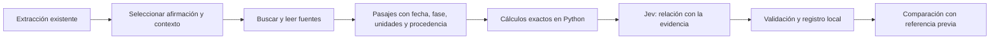

# Jev: cotejo de afirmaciones con fuentes

Experimento independiente de Subtitula, iniciado el 22 de septiembre de 2026.

**Estado a 23/09/2026: 28 evaluaciones reales completadas con Luna por suscripción; Jev sigue pendiente de acceso.** La suscripción está autorizada solo para este laboratorio; la integración futura usará TypeSafe por API. La referencia previa del asistente y las respuestas reales de Luna se guardan por separado.

- **[Resultados reales de Luna](reports/resultados-luna-suscripcion.md):** 23/23 etiquetas puntuables coinciden con evidencia seleccionada, dos respuestas tienen citas no literales y la búsqueda automática pierde un apoyo por recuperar el pasaje incorrecto.
- **[Protocolo de Luna y reproducción](docs/luna-suscripcion-experimento.md):** transporte aislado, consumo de suscripción, búsqueda local sobre documentos completos y comandos sin nuevas inferencias.

El ensayo reutiliza **cuatro afirmaciones de Luna xhigh** del pleno de Vigo del 23/12/2025. Conserva las afirmaciones originales en gallego, sus citas, identificadores y segundos de la grabación. El primer protocolo incorpora siete fuentes públicas y siete controles. La ampliación v2 prepara **24 fixtures semánticas y 10 escenarios técnicos** con esos mismos materiales. La búsqueda y selección de pasajes se han hecho manualmente; no existe todavía un buscador documental automático.

- **[Fixtures v2 y comandos de ejecución](fixtures/v2/README.md):** empezar por este pase cuando esté la clave; seis casos iniciales o 24 completos, métricas separadas y reproducción sin red.
- **[Plan de mitigación de fallos](docs/mitigacion-fallos-jev.md):** controles implementados, limitaciones, recuperación y criterios de avance.
- [Preparación y eficiencia orientativa](reports/fixtures-v2-preparacion.md): coste ilustrativo, llamadas evitables y qué falta medir.

- [Informe y evaluación de viabilidad](reports/viabilidad-y-preparacion.md).
- [Cómo se integraría](docs/integracion.md).
- [Casos y procedencia](inputs/cases.json), [fuentes](inputs/sources.json) y [referencia previa](inputs/reference.json).
- [Peticiones listas para enviar](inputs/requests/R04.json), [protocolo](config/protocol.json) y [huellas congeladas](inputs/frozen.json).
- [Estado de acceso](reports/access-status.json).

## Qué probamos



Jev clasifica en `supported`, `contradicted`, `insufficient`, `conflicting` o `not_verifiable`. También pregunta por cada pasaje, identificado con un ID cerrado. La confianza describe la salida del modelo; **no es un porcentaje de verdad de la afirmación**. Los documentos pueden contener opiniones, anuncios o afirmaciones repetidas: su naturaleza forma parte del input.

## Ejecutar desde este directorio

Python 3.11 o posterior, sin dependencias adicionales para preparar peticiones, llamar a Jev y reproducir respuestas guardadas.

```powershell
python scripts/benchmark.py prepare --selection full
python -m unittest discover -s scripts -p 'test_*.py' -v
```

Para la API directa, crear una clave en [la consola oficial de TypeSafe](https://console.typesafe.ai), usando una cuenta con acceso/saldo disponible. Guardarla localmente en `.env`, a partir de `.env.example`, bajo `TYPESAFE_API_KEY`; también se admite una variable de entorno. No escribir claves en el chat, informes, código o Git. Este directorio está fuera de los dos repositorios de la aplicación; su `.gitignore` prepara una futura incorporación a Git, pero no cifra ni protege el archivo local.

```powershell
python scripts/benchmark.py run --selection smoke --run-id fixtures-v2-smoke
python scripts/benchmark.py replay --run-id fixtures-v2-smoke
```

El benchmark usa el endpoint oficial `https://api.typesafe.ai/v1/systemone`, fija `jev-1.13.0` y no reintenta automáticamente. Guarda peticiones, respuestas, huellas, duración y tokens en `runs/<run-id>/`. Repetir el mismo pase reutiliza respuestas completadas; un fallo o resultado incierto detiene el pase. `replay` funciona sin red ni claves. Los tests usan respuestas fabricadas únicamente en directorios temporales: nunca se presentan como resultados reales. El protocolo original de 11 casos permanece disponible mediante `scripts/experiment.py prepare|run|replay`, con su propio `run-id`.

También existe un adaptador para Cloudflare. **Usarlo solo después de confirmar créditos existentes de AI Gateway**; no son la cuota gratuita de los modelos alojados por Workers AI. No se compran créditos ni se activan recargas desde este laboratorio.

```powershell
python scripts/experiment.py run --provider cloudflare --existing-cloudflare-credits --run-id v1-cloudflare
```

Lee `CLOUDFLARE_API_TOKEN` o la sesión local existente de Wrangler, y el identificador de cuenta del experimento anterior si no se aporta `CLOUDFLARE_ACCOUNT_ID`. No modifica Workers ni necesita arrancar la aplicación. El alias `typesafe/jev` de Cloudflare debe devolver la versión fijada; un cambio de versión se registra y rechaza para evitar mezclar resultados.

`scripts/prepare.py` documenta cómo se seleccionaron los casos a partir de los archivos anteriores y se comprobaron los extractos literales. Está bloqueado si ya existe `inputs/frozen.json`. Para otra selección, preservar este ensayo y crear una nueva versión. Las capturas originales de fuentes y los textos extraídos están en `sources/`; los PDF se leyeron con pypdf y sus pasajes relevantes se inspeccionaron visualmente con Poppler.

No se ha iniciado una nueva transcripción, desplegado servicios, reactivado desarrollo alojado ni modificado los dos repositorios. Este experimento no cambia las fases de producto ni habilita publicaciones automáticas.
