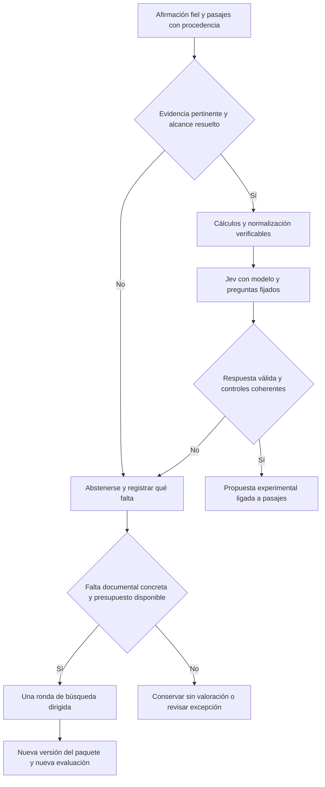

# Plan para mitigar fallos de Jev

22/09/2026. Este plan acompaña al [ensayo v2](../fixtures/v2/README.md). Distingue controles ya implementados en el laboratorio de trabajo necesario antes de integrar. No modifica las fases de producto ni autoriza publicar valoraciones.

**Evidencia posterior, 23/09/2026:** el [pase alternativo con Luna por suscripción](../reports/resultados-luna-suscripcion.md) completó 28 evaluaciones. Acertó las 23 etiquetas puntuables con pasajes seleccionados, pero produjo dos citas no literales, bloqueadas por validación. La búsqueda automática perdió un apoyo al recuperar una dotación en lugar del incremento. La siguiente mejora propuesta es mostrar citas desde los pasajes almacenados por ID, mejorar recuperación por alcance/relación y validar evidencia compuesta. Son resultados de Luna en una muestra pequeña, no pruebas del rendimiento de Jev.

La salida debe representar **la relación de una afirmación con una versión concreta de la evidencia**. Preservar el texto, hablante, cita y revisión originales. «Evidencia insuficiente» no equivale a falso; una contradicción documental no demuestra intención de mentir. Priorizar la detección de apoyos y refutaciones sin sustento, conservando también la cobertura útil.

TypeSafe documenta limitaciones con cifras, fechas, razonamiento indirecto, distractores y texto adversarial. Las preguntas de una llamada se evalúan independientemente, así que sus respuestas pueden discrepar. Esto justifica comprobar alcance y cálculos fuera del clasificador y medir errores semánticos además del esquema. [Limitaciones oficiales de Jev 1.13](https://docs.typesafe.ai/model-jaggedness/jev-1.13).

## 1. Controles y huecos actuales

| Fallo | Fixtures | Ya implementado | Siguiente mitigación |
|---|---|---|---|
| Afirmar sin evidencia o usar declaraciones como prueba | C03, C04, F07 | Abstención local cuando no hay pasajes o todos son declaraciones reproducidas; las copias comparten procedencia | Clasificar y auditar el tipo de fuente en la recuperación; deduplicar por documento y cadena de citas, no solo URL |
| Confundir anuncio, previsión, adjudicación y pago | R02, C05 | Contexto de fase en la petición y control negativo | Comprobar que afirmación y documento describen la misma fase; exigir liquidación/pago cuando se pregunta por ejecución |
| Comparar otro año, entidad o programa | R03, F04, F05 | Controles negativos; R03 excluido de puntuación | Normalización trazable de entidad, periodo y programa; no dar por buena una equivalencia de nombres sin evidencia |
| Fallar con impuestos, unidades o afirmaciones compuestas | R04, C02, F10, F11 | Cálculo exacto con Decimal para 95 × 1,10, con condiciones explícitas | Normalizar neto/bruto, €/t y periodo; descomponer componentes comprobables sin alterar la cita; falta de un componente impide apoyar toda la frase |
| Usar una fuente prestigiosa pero irrelevante | C06, F09 | Preguntas por pasaje, IDs cerrados y filtro de coherencia posterior | Recuperar pasajes pertinentes con su contexto de tabla, encabezado y notas; no confundir reputación del emisor con pertinencia |
| Tratar repetición como corroboración o esconder discrepancias | F07, F12 | Caso de duplicación y conflicto sintético; abstención ante `conflicting` | Añadir conflictos reales, versiones rectificadas y reglas documentadas de prioridad; dos medios que copian una nota no son dos pruebas |
| Cambiar por idioma u orden de pasajes | F01, F02, F08, F09 | Grupos de invariancia y pase de repetibilidad | Ampliar gallego/castellano y revisar traducciones; fijar orden estable; abstenerse cuando las variantes equivalentes discrepen |
| Seguir órdenes contenidas en una fuente | C07, F13 | Documentos delimitados como datos y dos pruebas de inyección; salida limitada a etiquetas | Mantener procedencia, limitar contexto y aislar la clasificación de herramientas/credenciales; tratar todo texto recuperado como no confiable |
| Confianza alta en una conclusión errónea | Todas; test de error con alta confianza | Contar falsos apoyos/refutaciones incluso con confianza alta; umbral provisional y abstención | Calibrar con ejemplos revisados y reservados; comparar error y cobertura por umbral, sin ajustar sobre la prueba final |
| Valoración global incompatible con relaciones por pasaje | R01 y tests locales | Exigir una relación alineada y ninguna opuesta para retener una propuesta | Validar combinaciones de evidencia y explicar qué componentes acreditan; no considerar las respuestas del mismo modelo como revisores independientes |
| Respuesta corrupta, incompleta o de otra versión | T05–T09 | Esquema, IDs, etiquetas, probabilidades, modelo fijo y huellas; guardar cuerpo HTTP recibido antes de rechazarlo | Nueva versión de ensayo para cambios del contrato/modelo; comparar resultados antes de migrar |
| Autenticación, límites, caída o respuesta incierta | T01–T04, T10 | Timeout de 45 s, cero reintentos automáticos, recibo previo a la llamada y consumo desconocido explícito | Clasificar errores operativos; alertar y reconciliar consumo antes de volver a enviar; política de reintentos acotada solo tras comprobar el contrato del proveedor |

Los controles locales operan sobre metadatos preparados manualmente: una fuente mal clasificada puede eludirlos. No existe aún un validador semántico determinista de municipio, año, fase y programa. Tampoco se ha demostrado resistencia general a inyecciones con dos ejemplos.

El filtro posterior es deliberadamente conservador: exigir un pasaje individual de apoyo puede descartar una conclusión válida que requiere combinar varios documentos, como base e IVA. Mediremos esa pérdida de cobertura. La solución futura sería validar componentes y composición; no convertir en apoyo cualquier conjunto de relaciones `context`.

## 2. Decisión y recuperación ante un fallo

Flujo propuesto para integración; los pasos de búsqueda adicional y revisión de excepciones todavía no están implementados:

- **Insuficiencia documental:** especificar qué falta, por ejemplo factura de Vigo, importe previo o liquidación. Buscar una vez por ese hueco con límites de tiempo/coste. Si no aparece, conservar `insufficient`. Repetir la misma pregunta al mismo corpus no añade evidencia.
- **Fuentes en conflicto:** conservar ambas versiones y examinar fecha, alcance, corrección o dependencia. Si ninguna prevalece con una regla justificable, mantener `conflicting`; no votar por número de URLs.
- **Fallo semántico:** conservar petición y respuesta erróneas como regresión. Distinguir extracción defectuosa, recuperación deficiente, referencia ambigua y clasificación incorrecta antes de ajustar preguntas. No cambiar la referencia solo para hacer coincidir al modelo.
- **Fallo técnico:** no emitir valoración. Un 401 requiere corregir acceso; un 429 o 529 deja el trabajo pendiente. Ante timeout/interrupción, el laboratorio evita el reenvío automático porque puede haberse procesado la petición. Preservar el pase fallido y revisar consumo/estado del proveedor antes de crear otro pase.
- **Cambio documental:** crear una nueva versión de la evidencia, recalcular y conservar la evaluación anterior como histórica. Una rectificación o retirada no debe dejar una etiqueta vigente sin aviso.

No sustituir silenciosamente Jev por otro modelo ni presentar una votación de varios modelos como evidencia. Cualquier alternativa necesita su propio ensayo y registro. La decisión editorial futura mostrará pasajes y límites; la app no recibirá un booleano inmutable `isTrue`.

## 3. Hitos y criterios de avance

| Hito | Trabajo | Criterio de salida |
|---|---|---|
| A. Preparación local | Congelar entradas, validar recibos y simular fallos | 16 tests locales pasan; 24 peticiones íntegras; cero inferencias reales durante la preparación |
| B. Primer acceso | Seis casos `smoke`, luego pase completo | Contrato y uso reales registrados; cualquier error queda visible. Un fallo técnico impide interpretar ese caso como evaluación terminada |
| C. Diagnóstico semántico | Inspeccionar todas las refutaciones/apoyos incorrectos, abstenciones esperadas e invariancias | Para avanzar a una prueba más amplia: ningún falso apoyo/refutación en los controles claros, abstención en los casos diseñados para ello y ninguna inversión en grupos equivalentes. Si falla, corregir causa en otra versión y volver a comprobar también datos nuevos |
| D. Evaluación independiente | Más plenos, municipios, asuntos y conflictos reales; revisión de una muestra de referencia | Reservar familias completas de afirmación para prueba final. No repartir una frase y sus paráfrasis entre ajuste y prueba. R03 requiere resolver identidad o seguir excluida |
| E. Piloto sin publicación | Procesar en paralelo al flujo existente, medir calidad, cobertura, recuperación y tiempo humano | Umbrales y tolerancia de error acordados sobre muestra independiente; revisión de excepciones compatible con el límite de trabajo humano del plan canónico; fases institucionales cumplidas |

Los criterios del hito C son de diagnóstico, no una certificación de seguridad: cero errores en tan pocos casos no acota bien la tasa real. Acertar controles artificiales no demuestra precisión sobre afirmaciones reales. Las repeticiones miden estabilidad, no aumentan el número de hechos independientes.

Para el hito D, registrar acuerdo entre revisores y motivos de desacuerdo en una muestra reservada. Esa revisión corresponde a construir una evaluación fiable, no a exigir revisión manual exhaustiva de cada afirmación en operación. El producto debe mantener el enfoque de revisión humana mínima del [plan canónico](../../../subtitula-gal-api/docs/product/transparency-evidence-search-implementation-plan.md): las excepciones no pueden convertirse en una cola obligatoria interminable; si no se resuelven, pueden quedar sin valoración.

El umbral 0,85 actual es exploratorio. Elegir umbrales futuros comparando falsas refutaciones, falso apoyo y cobertura en datos de ajuste; medir una vez en datos reservados. Un umbral puede diferir por tipo de decisión si hay evidencia suficiente para justificarlo. No interpretar una cifra como «85 % de verdad» ni habilitar publicación por superar ese valor.

## 4. Coste, trazabilidad y límites operativos

Ahora hay límites de 24.000 bytes por petición, 45 segundos por llamada y un máximo de tres repeticiones/72 llamadas por pase. No equivalen a un tope monetario garantizado. El pase completo normal hace 24 llamadas; smoke + completo hacen 30, pues la caché es por pase. Los escenarios de precio están separados del uso medido en el [informe de preparación](../reports/fixtures-v2-preparacion.md).

La ejecución guarda el modelo, huella del runner, manifiesto, petición, respuesta, duración y consumo. La reanudación reutiliza resultados completados del mismo pase; fallos o llamadas interrumpidas no se reenvían automáticamente. Es un runner secuencial, sin bloqueo entre procesos: no ejecutar simultáneamente el mismo `run-id`. La reproducción verifica huellas, pero no demuestra autenticidad frente a alguien que pueda alterar todos los archivos y manifiestos.

Antes de producción: persistir versiones y política, aplicar exclusión/estado transaccional por trabajo, presupuestos de consumo y tiempo para recuperación más inferencia, parada ante incidencias repetidas y una caché cuya clave incluya afirmación, revisión, evidencia, normalización, preguntas y modelo. Medir el coste por propuesta útil y el tiempo completo, no solo el HTTP de Jev. Si cambia el evaluador al reproducir respuestas, guardar también su versión y conservar el informe previo.

El laboratorio no publica resultados ni valora la honestidad de personas. Su utilidad inmediata es descubrir dónde abstenerse, qué evidencia falta y qué controles aportan calidad antes de plantear integración.
